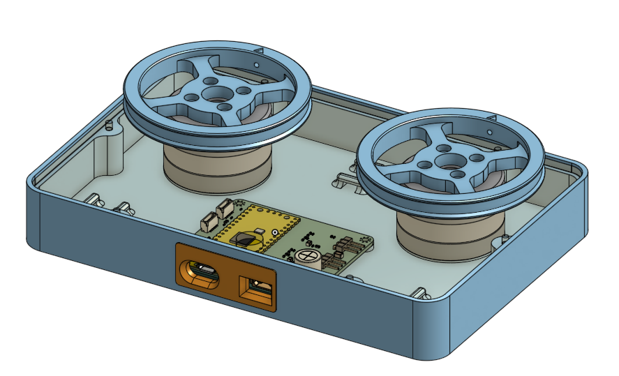
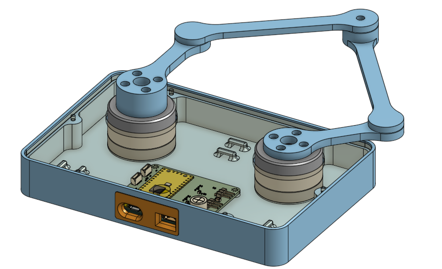

# MOTKINBENCH

MOTKINBENCH is a low-cost platform with two permanent-magnet synchronous motors (PMSMs)
for learning robotics and control on real hardware. The same motor base supports
two independent flywheels or a planar five-bar robot with two degrees of freedom.

The goal is to make it easy to experiment with motor control, robot kinematics,
and feedback control, and connect simulation with hands-on hardware experiments.

| Independent flywheels | Five-bar planar robot |
| --- | --- |
|  |  |

The motors use a custom [Raspberry Pi Pico dual-PMSM driver](https://github.com/thomasfla/pico_dual_PMSM_BUG79100G_DRV8316C).

- [Mechanical design in Onshape](https://cad.onshape.com/documents/581c9cc37f21d16430f878db/)
- [URDF export and simulation guide](urdf/README.md)

## Materials

| Quantity | Item |
| --- | --- |
| 2 | GM3506 gimbal motor with encoder |
| 18 | M2.5 × 6 mm socket head cap screw |
| 4 | M3 × 5 mm socket head cap screw |
| 1 set | PLA printed parts for the chosen setup — [Onshape CAD](https://cad.onshape.com/documents/581c9cc37f21d16430f878db/) |
| 1 | Custom dual-PMSM motor driver — [GitHub](https://github.com/thomasfla/pico_dual_PMSM_BUG79100G_DRV8316C) |
